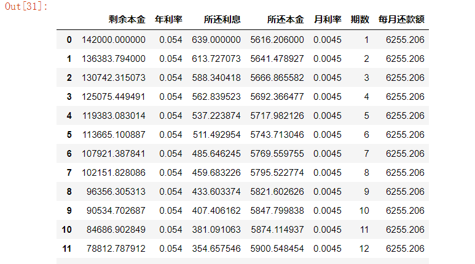
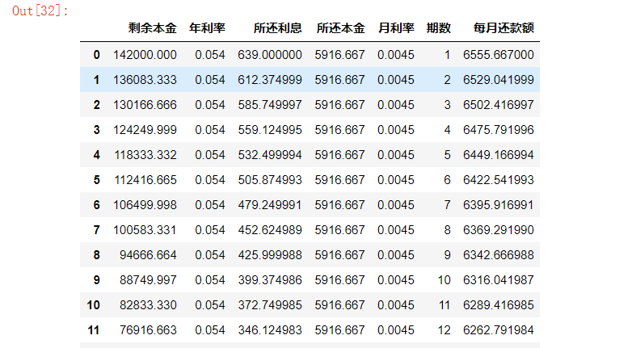
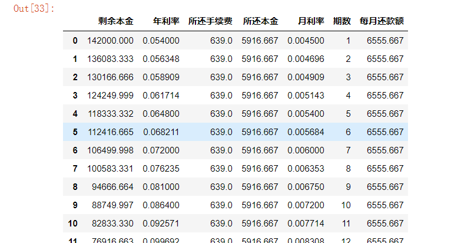
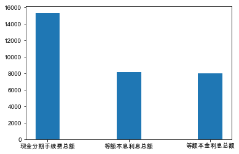
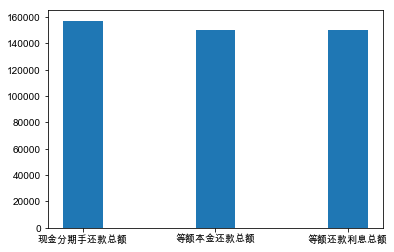
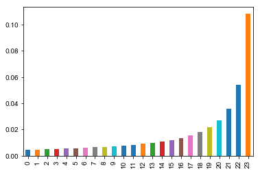
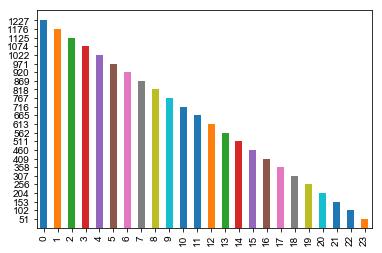
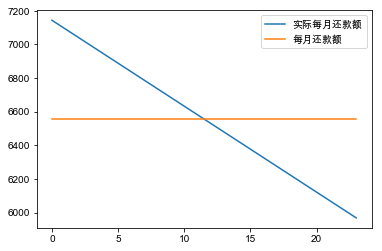

## 现金分期利率浅析

通过对现金分期的资金真实使用成本的分析，找到以等额本金形式还款时首月利率为0.45%时24期现金分期的真实利率水平。并分析现金分期与普通贷款相比对银行和借款人的益处，作为公司实体如何使用类似于现金分期的形式为客户提供金融服务并扩大自己的收益。
### 24期等额本息，24期等额本金，现金分期

等额本息

等额本金

现金分期

### 现金分期与等额本息/本金对比分析

### 首月利率为0.45%时现金分期月利率
月利率的变化趋势是先逐步平稳增加，到最后两三期时加速升高，最后到达惊人的10.80%（年化利率129.60%）

### 现金分期资金真实使用成本

### 现金分期对银行的益处浅析

* 利于风险控制
    * 能及时发现违约风险(未还款当期即可发现)
    * 额度根据客户征信情况而定，风险水平更低。
* 利于产品销售
    * 客户初期还款压力小(首月还7143.55与6555.67对比)
    * 让客户感觉便宜(首月费率等于0.45%)
* 实际收益可观(年化收益率达到10.37%)

### 对借款人益处浅析

* 获取资金更加方便快捷
     * 传统贷款需要办理各种抵押、各种手续，所以有种种不便；现金分期是凭信用借款，更加方便快捷。
* 还款压力小
    * 传统贷款到期还款时本息压力大
        到期后传统贷款需还本息合计（以10%年利率计算）：170400
    * 分期压力小
        相当于把压力平均分成24份，每期还款压力变小，总还款额也变小      
         (分期还款总额157336，比传统贷款减少13064)
* 流动资金增大
     * 能够有资金用于房贷首付等大额支出